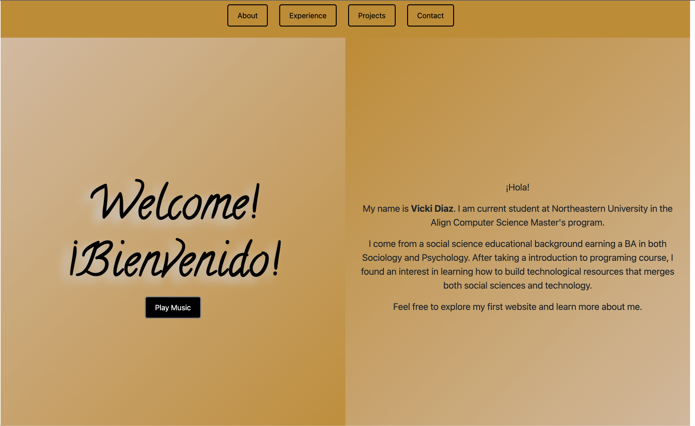

# Vickidiaz.github.io
Project_1 for CS5610. Building a personal website. 

# Author
Vicki Diaz

# Class Link
https://johnguerra.co/classes/webDevelopment_fall_2022/

# Project Objective
The objective of this project is to build a homepage that showcases who I am, my interest, and a place to show the projects that I will be working on soon. It was a class assignment for my web development course .

# Front-page screenshot 
 

# How to build
This is the link to the project: https://github.com/Vickidiaz/Vickidiaz.github.io
You can clone or fork the repository and run it in a browser after opening it on a local server. 

# slides link